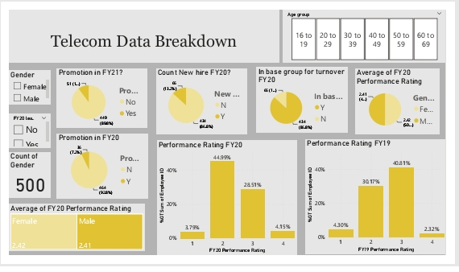
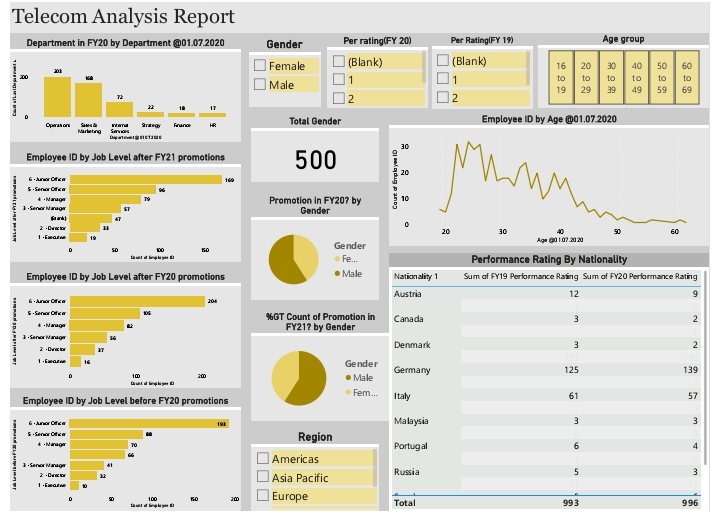
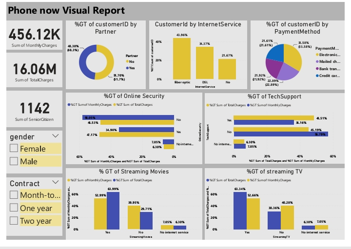

# josh_portfolio

# [Project-1: Telecommunication Data Model](https://github.com/ajeebs/josh_portfolio/edit/main/README.md)

This is a project i did on forage, where i built dashboards from three dataset to
communicate report to HR manager for decision making.
 - Data was taken from PwC Switzerland Power Bi job Simulation on Forage
 - The model uses both data cleaning and modeling, data visualization and communication
 - Leveraged analytical problem solving skills to examine HR data
 - Delivering valuable insight amd actionable suggestions based on data analysis

## Analysis Breakdown 
## Telecom Analysis Report 

## Customer retention Analysis z
