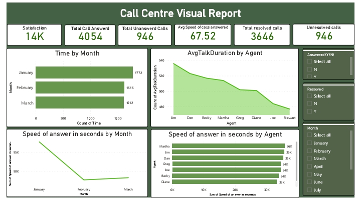
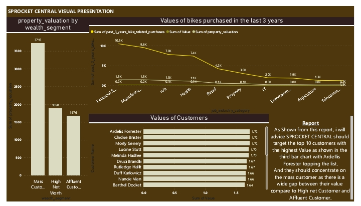

# josh_portfolio

# [Project-1: Telecommunication Data Model](https://github.com/ajeebs/josh_portfolio/edit/main/README.md)

This is a project i did on forage, where i built dashboards from three dataset to
communicate report to HR manager for decision making.
 - Data was taken from PwC Switzerland Power Bi job Simulation on Forage
 - The model uses both data cleaning and modeling, data visualization and communication
 - Leveraged analytical problem solving skills to examine HR data
 - Delivering valuable insight amd actionable suggestions based on data analysis

## Analysis Breakdown 

## Telecom Analysis Report 

## Customer retention Analysis 

## Call response 

# [Project-2: Marketing Data Model](https://github.com/ajeebs/josh_portfolio/edit/main/README.md)

This projecr was done during KPMG job Simulation_Data Analytic on Forage and majorly focused on 
data modelling , visualization and presentation.
 - Dataset was taken from KPMG job simulation on Data Analyyic on FORAGE
 - The project was focused on advising client (Sprocket Central Pty Ltd's)on customer targeting
 - The quality of the data was assessed by ensuring there are no blank spaces within the dataset and ctstomer field name are properly defined, and also make sure the text are well formated(DATA CLEANING)
 - Data modelling was done to merge the columns needed from the three sataset into one complete table for proper analysis
 - Data was analysed to target high valued customers based on demographic attributes
 - Developed dashboards to communicate findings with visuals

## Visual representation 
