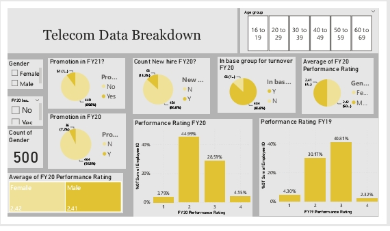
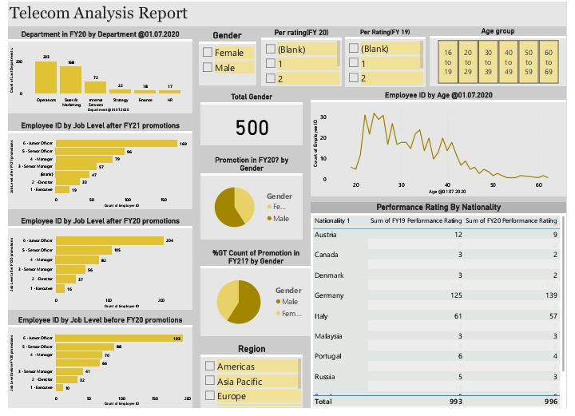
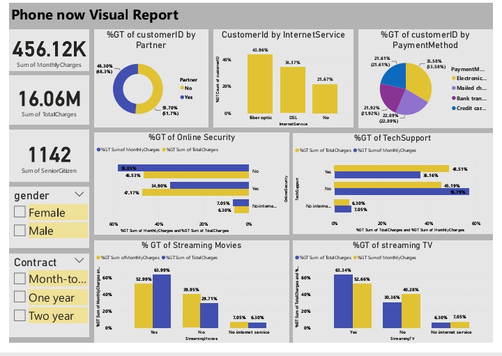
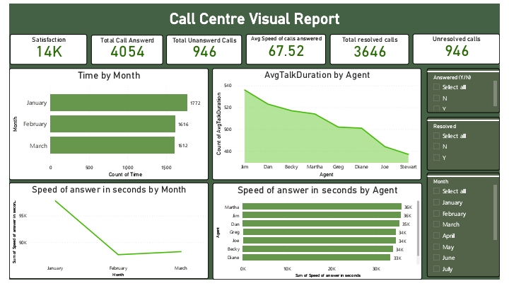
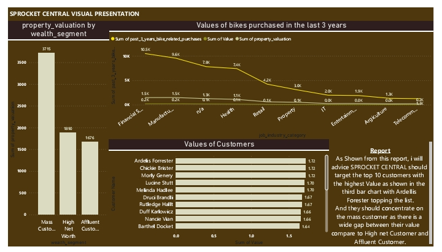

# josh_portfolio

# [Project-1: Superstore sales performance analysis](https://github.com/ajeebs/josh_portfolio/edit/main/README.md)

**Project Overview**
This project analyzes Super Store sales data to understand overall sales performance, customer purchasing patterns, product performance, regional performance, payment methods, returns, and shipping preferences.
The project uses Power BI to transform sales data into an interactive dashboard that provides a clear view of key business performance indicators and helps identify areas of strong performance and potential improvement.
The analysis covers 5,901 sales orders across 2019 and 2020, with total sales of approximately $1.57 million.

**Business Problem**

The business needed a clear way to understand its sales performance and identify the factors contributing to revenue and profitability.
The analysis focuses on questions such as:
 - How much revenue is the business generating?
 - How did sales change between 2019 and 2020?
 - Which product categories and sub-categories generate the most sales?
 - Which states contribute the most to sales and profit?
 - What payment methods do customers use most?
 - Which shipping methods are most frequently selected?
 - Which products or sub-categories have high return volumes?
 - Where are there differences between sales and profitability?

**Project Objectives**
The main objectives of this project were to:
 - Analyze overall sales performance.
 - Compare sales performance across years.
 - Identify high-performing product categories and sub-categories.
 - Examine sales and profit by state.
 - Analyze customer payment preferences.
 - Understand shipping method usage.
 - Examine product returns.
 - Create an interactive Power BI dashboard for business decision-making.

**Tools & Technologies**
Power BI
Used for:
 - Data visualization
 - Dashboard development
 - KPI creation
 - Interactive filtering
 - Business intelligence reporting
 - Data Analysis

The project involved:
 - Data preparation
 - Date analysis
 - Sales aggregation
 - Year-over-year comparison
 - Product performance analysis
 - Regional analysis
 - Customer behavior analysis

**Key Findings**
1. Sales increased substantially from 2019 to 2020
The supplied dataset shows:
2019 sales: approximately $564,679.49
2020 sales: approximately $1,001,124.83
This represents approximately 77.3% growth in sales from 2019 to 2020.

2. December 2020 recorded the highest monthly sales
Based on the supplied sales data, December 2020 generated approximately:
$166,185.85. This was the highest monthly sales figure in the dataset.
November 2020 was the second-highest month at approximately $130,960.83, followed by September 2020 at approximately $119,803.65.
This indicates a strong concentration of sales toward the later months of 2020.

3. Customer Payment Analysis
COD: 2,453 customers/orders — approximately 41.57%
Online: 2,164 — approximately 36.67%
Cards: 1,284 — approximately 21.76%

4. Shipping Analysis
Standard Class accounts for the largest number of orders, with 3,451 orders, followed by:
Second Class — 1,147
First Class — 959
Same Day — 344

**Business Insights**

The analysis provides several useful business insights:
1. Strong growth occurred in 2020
Sales increased by approximately 77.3% between 2019 and 2020.
The business should investigate the factors behind this growth and determine whether they can be sustained.
2. Sales are concentrated toward the end of the year
November and December 2020 were among the strongest sales months, with December recording the highest monthly sales.
This could be useful for inventory and marketing planning.
3. Office Supplies generated the largest category sales
The category generated approximately $640K in sales according to the dashboard.
Further analysis of its profitability could help determine whether its high revenue translates into equally strong profit.
4. Revenue does not tell the entire story
The dashboard reveals differences between sales and profit across states and sub-categories.
Therefore, management should consider profit margins and costs, not just sales revenue.
5. Standard shipping dominates order volume
Standard Class accounted for the largest number of shipping orders.
This provides useful information for logistics and fulfillment planning.
6. Returns require monitoring
With 287 returns, return patterns should be monitored by product and sub-category to identify areas where product quality, customer expectations or fulfillment processes may need attention.

**Business Recommendations**

Based on the analysis, the business could:
1.Investigate the drivers behind the strong 2020 sales growth.
2. Prepare inventory and marketing campaigns ahead of high-sales months.
3. Monitor profitability alongside revenue when evaluating products and regions.
4. Investigate products and sub-categories with relatively high return rates.
5. Review states generating sales but comparatively low or negative profit.
6. Continue monitoring customer payment preferences.
7. Use shipping data to optimize logistics and delivery planning.
8. Analyze high-performing products and customers to identify opportunities for continued growth.

## Sales Overview 

## Sales(State) Overview 

# [Project-2: Telecommunication Data Model](https://github.com/ajeebs/josh_portfolio/edit/main/README.md)

This is a project i did on forage, where i built dashboards from three dataset to
communicate report to HR manager for decision making.
 - Data was taken from PwC Switzerland Power Bi job Simulation on Forage
 - The model uses both data cleaning and modeling, data visualization and communication
 - Leveraged analytical problem solving skills to examine HR data
 - Delivering valuable insight amd actionable suggestions based on data analysis

## Analysis Breakdown 

## Telecom Analysis Report 

## Customer retention Analysis 

## Call response 

# [Project-3: Marketing Data Model](https://github.com/ajeebs/josh_portfolio/edit/main/README.md)

This projecr was done during KPMG job Simulation_Data Analytic on Forage and majorly focused on 
data modelling , visualization and presentation.
 - Dataset was taken from KPMG job simulation on Data Analysis on FORAGE
 - The project was focused on advising client (Sprocket Central Pty Ltd's)on customer targeting
 - The quality of the data was assessed by ensuring there are no blank spaces within the dataset and ctstomer field name are properly defined, and also make sure the text are well formated(DATA CLEANING)
 - Data modelling was done to merge the columns needed from the three sataset into one complete table for proper analysis
 - Data was analysed to target high valued customers based on demographic attributes
 - Developed dashboards to communicate findings with visuals

## Visual representation 
